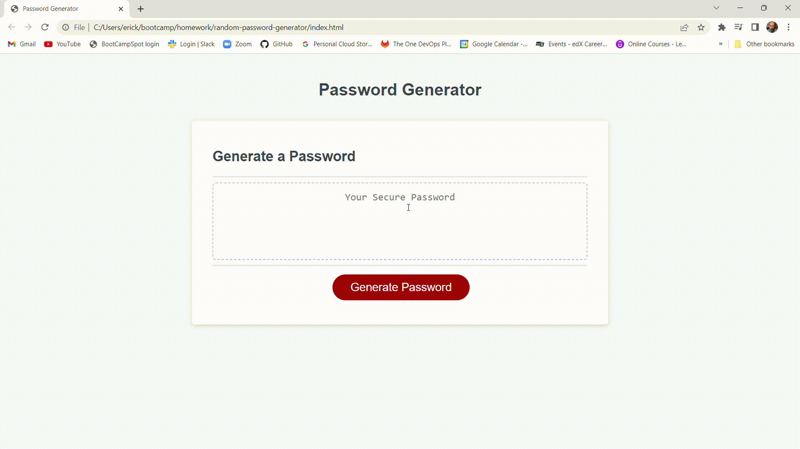

# Random Password Generator

## Description

This is my random password generator!  I built this to gain a better understanding on how to utilize different javascript applications.  I wanted the generator to definitely contain at least one character from each type the user chooses.  I also used the Fisher-Yates shuffling algorithm since it's a better method for randomizing code compared to other methods.

## Installation

N/A

## Usage

This program will generate a random password between 8 and 128 characters.  After pressing the start button, the user will be asked how long they want their passowrd to be, and what types of characters they want to include.  The password will definitely include at least one of every character type the user chooses.  Once all the choices are made, the program will display the password in the text box on the screen.

## Credits

w3schools.com

Fisher-Yates for their randomizing algorithm

## License

N/A
